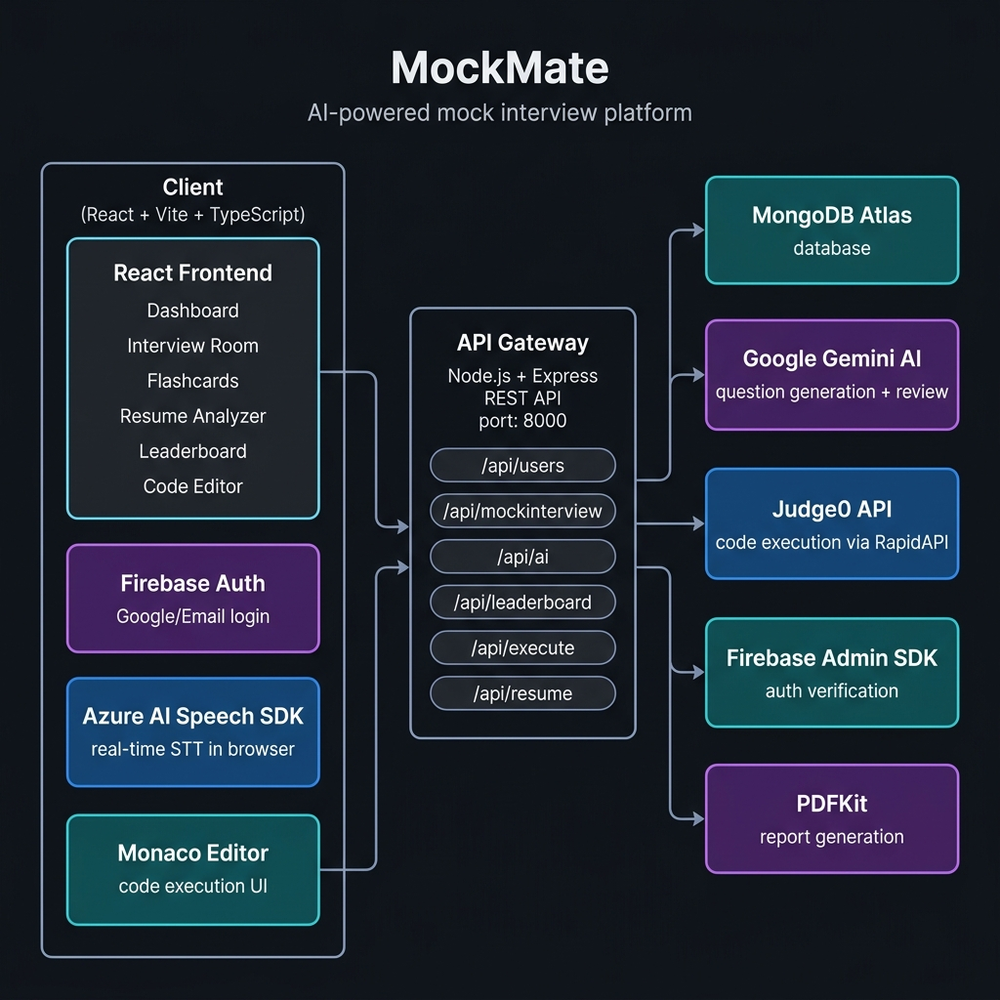

<h1 align="center">
  <br>
  🎯 MockMate
  <br>
</h1>

<h4 align="center">AI-powered mock interview platform that simulates real interviews with voice, code, and smart feedback — so you walk in prepared, not surprised.</h4>

<p align="center">
  <a href="https://github.com/VedantPawar05/Mockmate/stargazers">
    
  </a>
  <a href="https://github.com/VedantPawar05/Mockmate/network/members">
    
  </a>
  
  
  
  
</p>

<p align="center">
  <a href="#-demo">Demo</a> •
  <a href="#-features">Features</a> •
  <a href="#%EF%B8%8F-tech-stack">Tech Stack</a> •
  <a href="#-architecture">Architecture</a> •
  <a href="#-getting-started">Getting Started</a> •
  <a href="#-api-endpoints">API Endpoints</a> •
  <a href="#-future-scope">Future Scope</a>
</p>

---

## 🎬 Demo

> **Live Demo:** _Coming soon / Add Netlify link here_

| Dashboard | Interview Room | Resume Analyzer |
|-----------|---------------|-----------------|
| _(screenshot)_ | _(screenshot)_ | _(screenshot)_ |

> 📸 **Tip for recruiters:** Clone + run with `npm run dev` in both `/client` and `/server`, or check the [Getting Started](#-getting-started) section below.

---

## ✨ Features

- 🤖 **AI Question Generation** — Gemini AI generates role-specific, dynamic interview questions (DSA, Core CS, System Design, HR)
- 🎙️ **Real-Time Voice Transcription** — Azure AI Speech-to-Text converts your spoken answers to text live, during the interview
- 💻 **In-Browser Code Editor** — Monaco Editor (same as VS Code) with Judge0 API for multi-language code execution & evaluation
- 📄 **Smart Resume Analyzer** — Upload your PDF resume; Gemini AI scores it and suggests targeted improvements
- 📊 **Performance Analytics** — Visual dashboards showing your weak topics, score trends, and interview history using Recharts
- 🏆 **Leaderboard** — Compete with other users and track your rank across sessions
- 🃏 **AI Flashcards** — Auto-generated flashcards based on your weak areas to help you revise smarter
- 📑 **PDF Report Export** — Download a detailed performance report for any completed interview session
- 🔐 **Secure Auth** — Firebase Authentication (Google + Email/Password) + JWT-based session management
- 🏢 **Company-Specific Prep** — Tailored question sets based on target company interview patterns

---

## 🛠️ Tech Stack

### Frontend
| Technology | Purpose |
|---|---|
| React 18 + Vite + TypeScript | Core UI framework |
| Tailwind CSS + Radix UI | Styling & accessible component primitives |
| React Router v7 | Client-side navigation |
| Monaco Editor (`@monaco-editor/react`) | In-browser code editor (VS Code engine) |
| Azure AI Speech SDK | Real-time speech-to-text in browser |
| Firebase JS SDK | Google/Email authentication |
| Recharts | Performance analytics charts |
| Axios | HTTP client |

### Backend
| Technology | Purpose |
|---|---|
| Node.js + Express.js + TypeScript | REST API server |
| MongoDB + Mongoose | Database & ODM |
| Firebase Admin SDK | Server-side auth token verification |
| Google Gemini AI API | Question generation, answer review, resume analysis |
| Judge0 API (via RapidAPI) | Sandboxed multi-language code execution |
| PDFKit | Dynamic PDF report generation |
| Multer | PDF resume file upload handling |
| JWT + bcryptjs | Session tokens & password hashing |
| Serverless HTTP | AWS Lambda adapter |

### DevOps & Deployment
| Service | Role |
|---|---|
| AWS Lambda + API Gateway | Serverless backend deployment |
| Netlify | Frontend hosting |
| MongoDB Atlas | Cloud database |
| Docker | Containerized backend (Dockerfile included) |

---

## 🏗️ Architecture



---

## 📁 Folder Structure

```
MockMate/
├── client/                     # Frontend (React + Vite)
│   ├── src/
│   │   ├── api/                # Axios API call wrappers
│   │   ├── components/         # Reusable UI components
│   │   ├── hooks/              # Custom React hooks
│   │   ├── pages/              # Route-level page components
│   │   │   ├── Dashboard.tsx
│   │   │   ├── CreateInterview.tsx
│   │   │   ├── InterviewInterfacePage.tsx
│   │   │   ├── InterviewDetails.tsx
│   │   │   ├── InterviewHistory.tsx
│   │   │   ├── ResumeAnalyzer.tsx
│   │   │   ├── Analyzer.tsx
│   │   │   ├── Flashcards.tsx
│   │   │   ├── Leaderboard.tsx
│   │   │   ├── LandingPage.tsx
│   │   │   ├── LoginPage.tsx
│   │   │   └── SignupPage.tsx
│   │   ├── types/              # TypeScript type definitions
│   │   └── utils/              # Helper utilities
│   └── .env                    # Client env vars (see below)
│
├── server/                     # Backend (Node.js + Express)
│   ├── src/
│   │   ├── config/             # App configuration
│   │   ├── controllers/        # Route handler logic
│   │   │   ├── gemini.controllers.ts      # AI question gen & review
│   │   │   ├── mockinterview.controllers.ts
│   │   │   ├── resume.controllers.ts      # PDF parsing + AI analysis
│   │   │   ├── judge0.controllers.ts      # Code execution
│   │   │   ├── report.controllers.ts      # PDF report generation
│   │   │   ├── analytics.controllers.ts   # Performance weakness detection
│   │   │   ├── leaderboard.controllers.ts
│   │   │   ├── learning.controllers.ts
│   │   │   └── user.controllers.ts
│   │   ├── database/           # MongoDB connection
│   │   ├── firebase/           # Firebase Admin setup
│   │   ├── middlewares/        # Auth middleware (JWT)
│   │   ├── models/             # Mongoose schemas
│   │   ├── routes/             # Express route definitions
│   │   ├── types/              # TypeScript types
│   │   └── utils/              # Async handler, helpers
│   ├── Dockerfile
│   └── .env                    # Server env vars (see below)
│
└── README.md
```

---

## 🚀 Getting Started

### Prerequisites
- Node.js v18+
- MongoDB Atlas account (or local MongoDB)
- Google Gemini API key
- Azure Cognitive Services account (for Speech-to-Text)
- Firebase project
- RapidAPI account with Judge0 subscribed

### 1. Clone the Repository

```bash
git clone https://github.com/VedantPawar05/Mockmate.git
cd Mockmate
```

### 2. Setup Server

```bash
cd server
npm install
```

Create a `.env` file in `/server` (see [Environment Variables](#-environment-variables)):

```bash
cp .env.example .env   # then fill in your values
npm run dev            # Starts on http://localhost:8000
```

### 3. Setup Client

```bash
cd client
npm install
```

Create a `.env` file in `/client`:

```bash
cp .env.example .env   # then fill in your values
npm run dev            # Starts on http://localhost:5173
```

---

## 🔐 Environment Variables

### `/server/.env`

```env
# Database
MONGO_URI=                        # MongoDB Atlas connection string

# Auth
JWT_SECRET=                       # Random secret string for JWT signing

# CORS
FRONTEND_URL=http://localhost:5173

# Google Gemini AI
GEMINI_API_KEY=                   # From https://aistudio.google.com/

# Firebase Admin (for server-side token verification)
FIREBASE_ACCOUNT_PROJECT_ID=
FIREBASE_ACCOUNT_CLIENT_EMAIL=
FIREBASE_ACCOUNT_PRIVATE_KEY=     # Multi-line key — wrap in quotes

# Judge0 (Code Execution via RapidAPI)
JUDGE0_API_URL=https://judge0-ce.p.rapidapi.com
JUDGE0_API_KEY=                   # From https://rapidapi.com/judge0-official/api/judge0-ce
JUDGE0_API_HOST=judge0-ce.p.rapidapi.com
```

### `/client/.env`

```env
# Backend API
VITE_API_BASE_URL=http://localhost:8000

# Azure AI Speech-to-Text
VITE_AZURE_SUBSCRIPTION_KEY=      # From Azure Cognitive Services
VITE_AZURE_REGION=                # e.g. eastus

# Firebase (from Firebase Console → Project Settings)
VITE_FIREBASE_API_KEY=
VITE_FIREBASE_AUTH_DOMAIN=
VITE_FIREBASE_PROJECT_ID=
VITE_FIREBASE_STORAGE_BUCKET=
VITE_FIREBASE_MESSAGING_SENDER_ID=
VITE_FIREBASE_APP_ID=
VITE_FIREBASE_MEASUREMENT_ID=
```

---

## 📡 API Endpoints

### Auth & Users — `/api/users`
| Method | Endpoint | Description | Auth |
|--------|----------|-------------|------|
| `POST` | `/register` | Register new user | ❌ |
| `POST` | `/login` | Login with email/password | ❌ |
| `GET` | `/getuserdetails` | Get logged-in user profile | ✅ |
| `GET` | `/dashboard-stats` | Get user's dashboard stats | ✅ |
| `PUT` | `/edit` | Update user profile | ✅ |
| `POST` | `/logout` | Logout user | ✅ |

### Mock Interviews — `/api/mockinterview`
| Method | Endpoint | Description | Auth |
|--------|----------|-------------|------|
| `POST` | `/create` | Create a new interview session | ✅ |
| `GET` | `/` | Get all interviews for user | ✅ |
| `GET` | `/:id` | Get interview by ID | ✅ |
| `PUT` | `/edit/:id` | Update interview session | ✅ |
| `DELETE` | `/delete/:id` | Delete interview session | ✅ |

### AI (Gemini) — `/api/ai`
| Method | Endpoint | Description | Auth |
|--------|----------|-------------|------|
| `POST` | `/generatequestions` | Generate role-specific interview questions | ✅ |
| `POST` | `/generatereview` | AI review & score of a submitted answer | ✅ |

### Features — `/api`
| Method | Endpoint | Description | Auth |
|--------|----------|-------------|------|
| `GET` | `/leaderboard` | Get global leaderboard rankings | ✅ |
| `POST` | `/resume/analyze` | Upload PDF resume & get AI analysis | ✅ |
| `POST` | `/execute` | Execute code via Judge0 | ✅ |
| `GET` | `/reports/pdf/:sessionId` | Download PDF performance report | ✅ |
| `GET` | `/companies` | Get all company interview configs | ✅ |
| `GET` | `/companies/:companyName` | Get config for specific company | ✅ |

### Learning — `/api/learning`
| Method | Endpoint | Description | Auth |
|--------|----------|-------------|------|
| `GET` | `/playlist/:topic` | Get learning playlist by topic | ✅ |
| `POST` | `/progress` | Save learning progress | ✅ |
| `GET` | `/progress/:userId` | Get user's learning progress | ✅ |
| `DELETE` | `/progress/:userId/:topic` | Reset progress for a topic | ✅ |

### Analytics — `/api/analytics`
| Method | Endpoint | Description | Auth |
|--------|----------|-------------|------|
| `GET` | `/weakness` | Get AI-analyzed weak areas from history | ✅ |

---

## 🔮 Future Scope

- 🤝 **Peer-to-Peer Mock Interviews** — Real-time collaborative interviews between two users via WebRTC
- 🧠 **Adaptive Difficulty** — Questions that get harder/easier based on live performance signals
- 📱 **Mobile App** — React Native port for on-the-go interview prep
- 🔗 **LinkedIn Integration** — Auto-populate job role from LinkedIn profile for instant personalized prep
- 🌍 **Multilingual Support** — Azure STT + Gemini to support interviews in regional languages
- 📹 **Video Analysis** — Webcam-based posture, eye contact, and confidence scoring using MediaPipe
- 🏢 **Enterprise Dashboard** — For companies to run structured technical screening pipelines
- 🔔 **Streak & Notifications** — Daily practice streaks with push notifications to keep users consistent

---

## 👥 Contributors

<table>
  <tr>
    <td align="center">
      <a href="https://github.com/VedantPawar05">
        <b>Vedant Pawar</b>
      </a>
    </td>
  </tr>
</table>

Pull requests are welcome! Feel free to open an issue first to discuss what you'd like to change.

---

## 📄 License

This project is open-source. See the [LICENSE](./LICENSE) file for details.

---

<p align="center">
  Made with ❤️ by <a href="https://github.com/VedantPawar05">Vedant Pawar</a>
</p>
